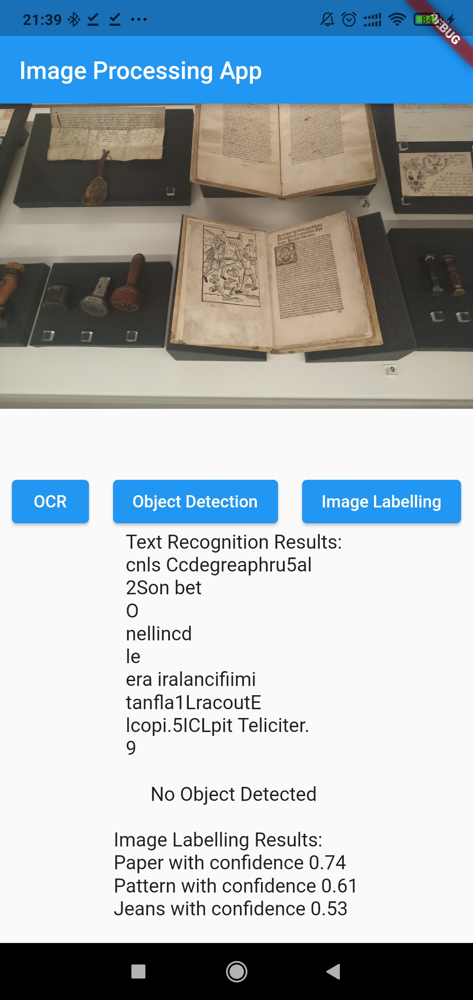

# Mobile and Multimedia System Lab 3 - Image Processing Application

 &nbsp;  &nbsp;  &nbsp;  &nbsp;
 &nbsp;  &nbsp;
 

Feature:

- Process image from gallery
- Do text recognition on image
- Detect object in image - pretrained model Mobile SSD TFlite (from Firebase MLKit) with only 5 categories (home good, fashion good, food, plant, place)
- Classify image's label
